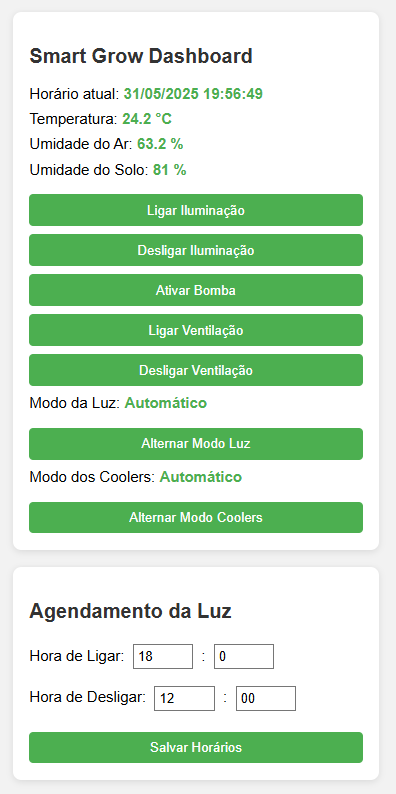

# 🌱 Smart-Grow_ESP32

Sistema de estufa automatizada com ESP32, desenvolvido inicialmente como projeto interdisciplinar na FATEC e aprimorado de forma independente. O projeto permite controle automático e manual da iluminação e ventilação, além de interface web simples embarcada no próprio microcontrolador.

## 🚀 Funcionalidades

- 💡 Controle automático da luz com base em horários configuráveis
- 🌬️ Acionamento automático dos coolers quando a temperatura estiver elevada
- 📲 Controle manual (ligar/desligar luz e ventilação) via dashboard embutida
- 🌡️ Leitura em tempo real de temperatura e umidade do ar (DHT22)
- 🌱 Sensor capacitivo de umidade do solo para testes de rega automática
- 🧪 Funcionalidade de rega automática **testada e pronta**, aguardando integração

## 🖥️ Interface

Dashboard HTML/CSS/JS hospedada no próprio ESP32.
Atualmente simples, mas com planos futuros de evolução com React e monitoramento remoto com histórico.

## ⚙️ Componentes Utilizados

- ESP32
- Sensor DHT22 (temperatura e umidade do ar)
- Sensor capacitivo de umidade do solo
- Relé 5V
- Coolers de ventilação
- Lâmpada LED
- Fonte 5V

## 📌 Próximas Melhorias

- ✅ Integração da rega automática
- 📊 Dashboard com histórico de dados do cultivo
- ☁️ Monitoramento remoto (ex: Firebase, MQTT, etc)
- 🧠 Otimização da lógica de controle (ex: algoritmos preditivos)

## 📸 Imagens

